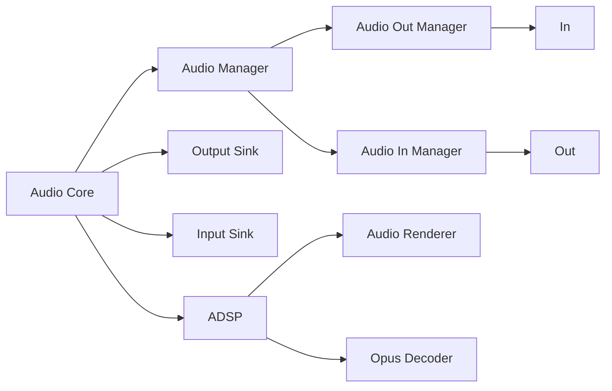
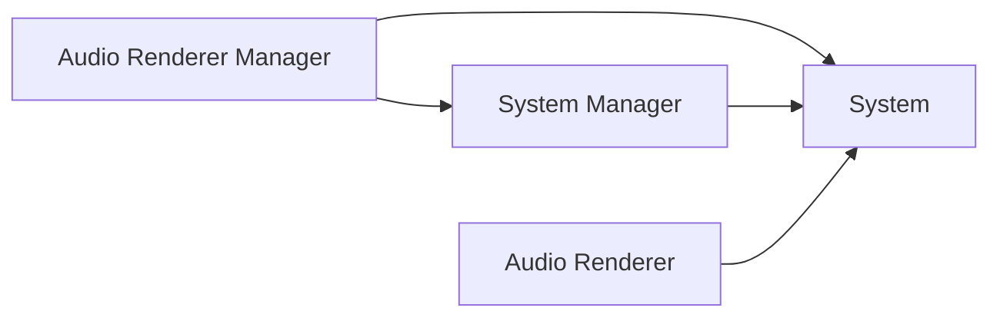
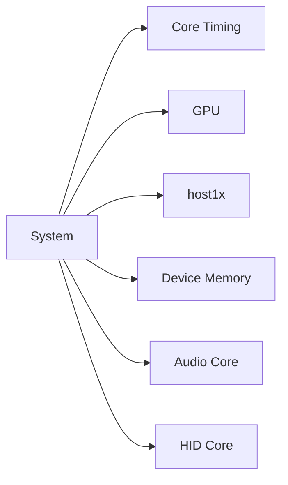
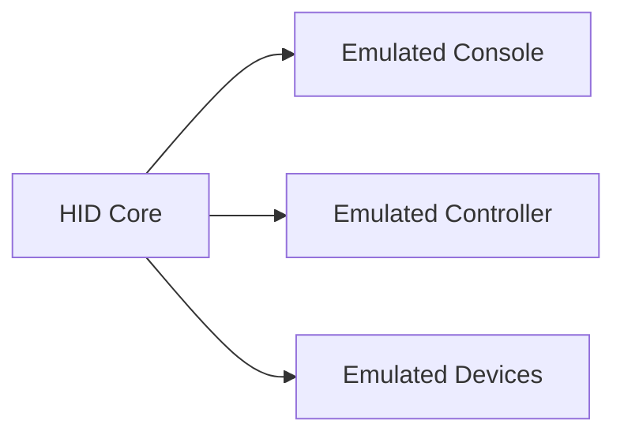
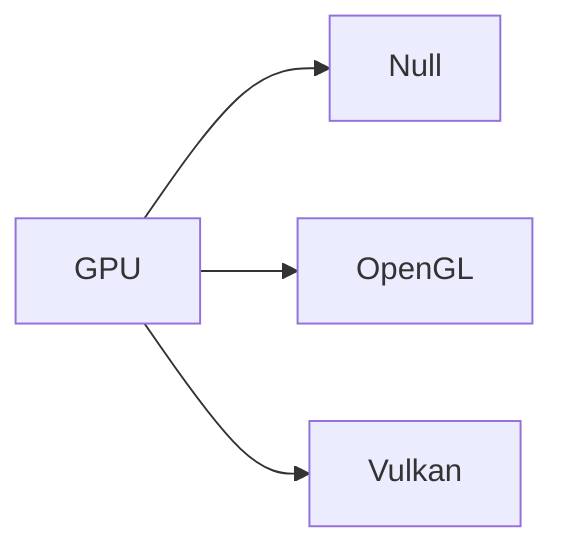

# Core

Core forms the emulated Switch hardware and is comprised of 4 parts.

| Name | Description |
| - | - |
| `/src/audio_core`  | Switch audio |
| `/src/core`        | Switch CPU / GPU hardware |
| `/src/hid_core/`   | Switch inputs |
| `/src/video_core/` | Switch GPU video |

## Audio Core

Audio core holds the audio manager, sinks, and the Application Digital Signal Processor (ADSP) for audio.

Audio buffers are used to represent audio into the Switch and played by the Switch. Audio manager frees audio buffers after they finish playing. It accomplishes this by waiting for events from the audio in and out managers. The audio in manager has 4 sessions accepting audio buffers with independently controllable volume. The audio out manager has 12 sessions accepting audio buffers with independently controllable volume.

Yuzu audio sinks are abstractions over audio sinks for various platforms.

The ADSP emulates the audio system module on The Switch Nvidia Tegra. The audio renderer takes commands and generates audio. Opus decoder decodes Opus audio packets into PCM data.

The system processes commands for audio rendering. The audio renderer wraps the system to handle adding and removing the system from the system manager. The system manager holds systems and instructs systems to process audio commands in a thread. The audio render manager wraps the system manager to implement additional functionality---this is the top-level manager.

## Core, Core

System (dfferent from System in audio) is the top-level class describing an emulated Switch. It holds the classes for all the emulated subsystems. These are primarily classes for emulating hardware and the kernel. Some other miscellaneous classes are for debugging, telemetry, and cheats.

The hardware excluding the CPU is emulated as follows, CPU is handled by the kernel. Core timing is used to receive a callback at a future point in time for the emulated Switch, such as implementing CPU hardware timers. GPU emulates the Nvidia Tegra used on the Switch. host1x emulates the host1x module on the Nvidia Tegra, see video core for details. Device memory emulates the Switch address space. Audio core emulates audio. HID core emulates HID devices.

The kernel emulates the system calls and processes available in the Switch kernel. It is mostly analguous to computer kernels, it schedules processes, manages threads, memory, etc. Unlike computer kernels, Yuzu kernel creates emulated CPU cores to execute Switch code. The program loader and filesystem are not part of the kernel. The kernel core is the top-level class holding all kernel related functionality.

ARM CPU core is emulated using a JIT compiler [dynarmic](https://github.com/yuzu-mirror/dynarmic).

Programs are loaded into the system using `System::Load`, which invokes the apprporiate loaders to handle the different file formats.

Networking is emulated by replicating the socket API.

Debugger GDB can be remotely connected.

## HID Core

HID core emulates the HID devices to the Switch. Emulated console handles all inputs in the Switch. Emulated controller is an emulated Switch controller. Emulated devices is an emulated input device that is not a controller, such as a keyboard or mouse.

Special devices for the Switch such as the Ring-Con is emulated using HID bus.

The actual inputs (buttons, motion sensors, touch screens, etc ...) of the Switch are implemented in Resource manager.

The clustering, image transfer, IR LED, pointing, Tera plugin processors are associated with a controller to provide inputs. These processors are ran in a Yuzu kernel service.

## Video Core

Video core has 2 major components, host1x emulation (emulating Switch GPU) and GPU rendering for the computer running Yuzu.

Host1x emulates the host1x module on the Nvidia Tegra.

The renderer produces images shown to the user of the emulator. The naming here is based on [Vulkan](https://docs.vulkan.org/guide/latest/decoder_ring.html). The top-level class is `GPU`, which creates a null, OpenGL, or Vulkan renderer. The null renderer only accepts commands and does nothing for testing. The majority of the files are used for subsystems of these renderers.

