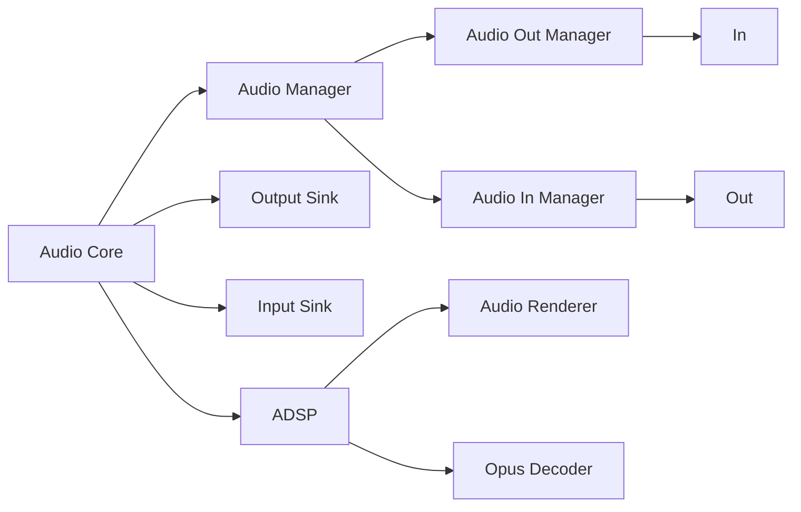
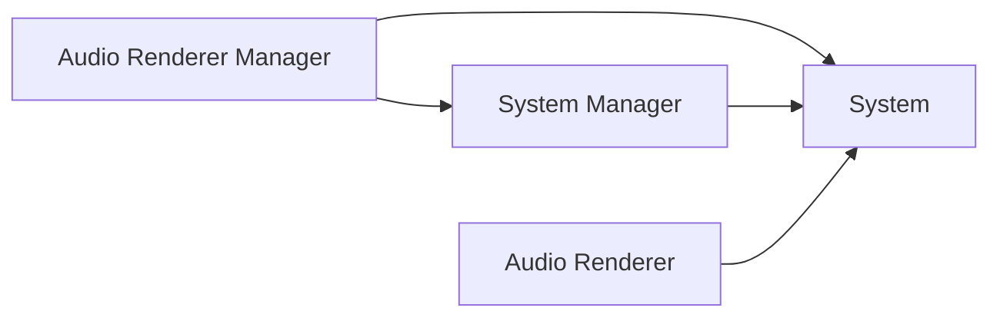

# Core

Core forms the emulated Switch hardware and is comprised of 4 parts. The top-level class is `Core::System`.

| Name | Description |
| - | - |
| `/src/audio_core`  | Switch audio |
| `/src/core`        | Switch CPU / GPU hardware |
| `/src/hid_core/`   | Switch inputs |
| `/src/video_core/` | Switch GPU video |

## Audio Core

Audio core holds the audio manager, sinks, and the Application Digital Signal Processor (ADSP) for audio.

Audio buffers are used to represent audio into the Switch and played by the Switch. Audio manager frees audio buffers after they finish playing. It accomplishes this by waiting for events from the audio in and out managers. The audio in manager has 4 sessions accepting audio buffers with independently controllable volume. The audio out manager has 12 sessions accepting audio buffers with independently controllable volume.

Yuzu audio sinks are abstractions over audio sinks for various platforms.

The ADSP emulates the audio system module on The Switch Nvidia Tegra. The audio renderer takes commands and generates audio. Opus decoder decodes Opus audio packets into PCM data.

The system processes commands for audio rendering. The audio renderer wraps the system to handle adding and removing the system from the system manager. The system manager holds systems and instructs systems to process audio commands in a thread. The audio render manager wraps the system manager to implement additional functionality---this is the top-level manager.

## Core, Core

ARM CPU is emulated using JIT with [dynarmic](https://github.com/yuzu-mirror/dynarmic).

Debugger GDB can be remotely connected.

## HID Core

## Video Core
